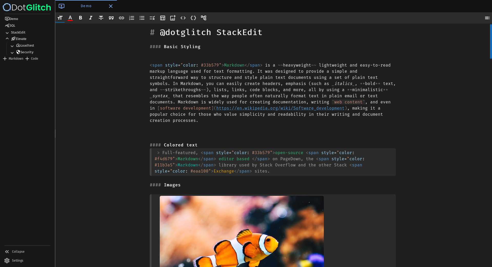
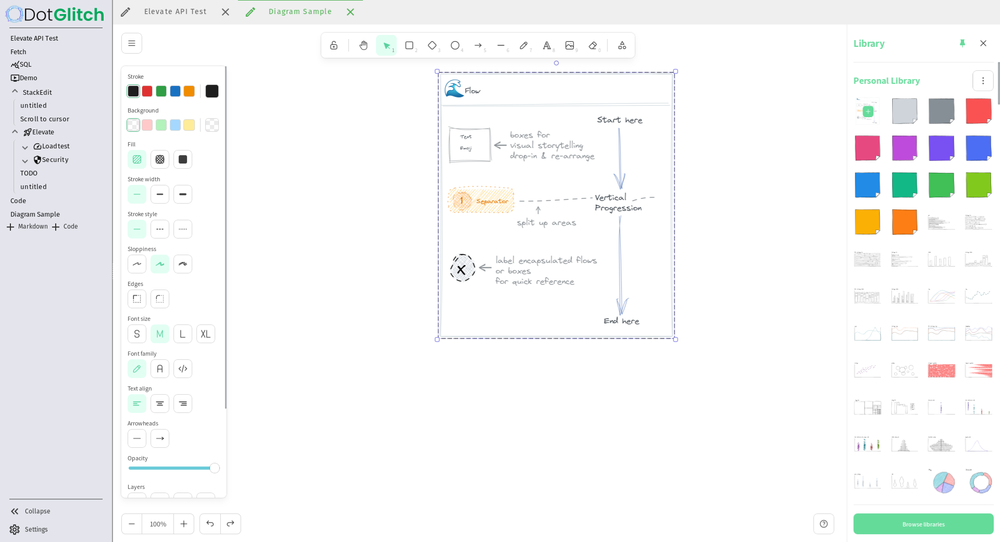
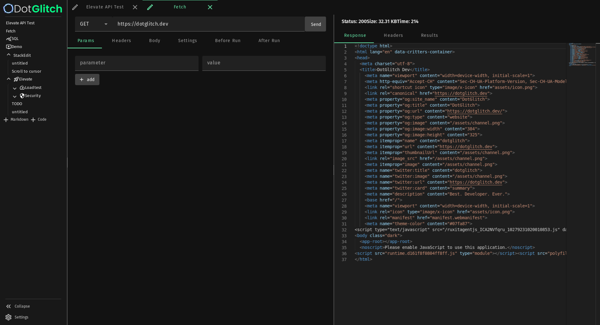
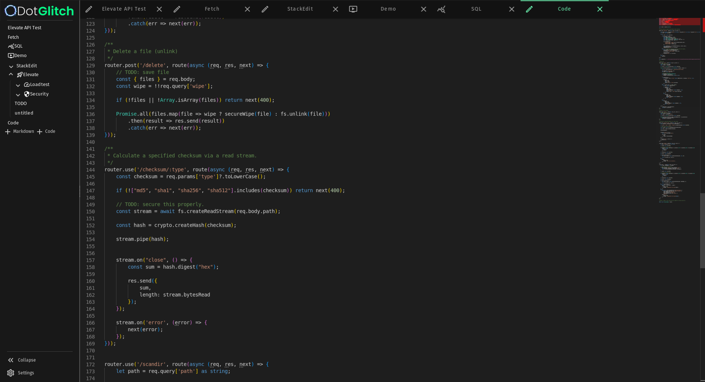

# ngx-stackedit

[](https://www.npmjs.com/package/ngx-stackedit)
[](https://www.npmjs.com/package/ngx-stackedit)
[](https://npmjs.org/ngx-stackedit)
[](https://github.com/knackstedt/stackedit)

StackEdit aspires to surpass all other markdown editors, becoming the most formidable and feature-rich markdown editor in the market. With a focus on power and versatility, we designed it to empower your markdown editing experience like never before

> With the goal of burying all other markdown editors six feet under, we sometimes have to take risky measures. One of those measures is acting like we're better than the other markdown editors. Because we are.

## Features:

- **Rich Text Editing**: Enjoy a seamless editing experience with real-time Markdown rendering, making it easier than ever to see your content come to life as you type.

- **Syntax Highlighting**: Write and edit code in style with syntax highlighting for various programming languages, ensuring your code looks as good as it works.

- **Color Customization**: Express your creativity by customizing the editor's color scheme to match your unique preferences or brand aesthetics.

- **Mermaid Charts**: Effortlessly integrate Mermaid charts into your documents for visually appealing data visualization.

- **Scroll Syncing**: Experience a fluid writing and reading experience with scroll syncing, keeping your place in your document no matter where you are.






---

Demo:
https://dotglitch.dev/#/StackEdit

<!-- ### Ecosystem

- [Chrome app](https://chrome.google.com/webstore/detail/iiooodelglhkcpgbajoejffhijaclcdg)
- NEW! Embed StackEdit in any website with [stackedit.js](https://github.com/benweet/stackedit.js)
- NEW! [Chrome extension](https://chrome.google.com/webstore/detail/ajehldoplanpchfokmeempkekhnhmoha) that uses stackedit.js
- [Community](https://community.stackedit.io/) -->

### Quickstart

##### Install

```bash
    npm i -S ngx-stackedit
```

##### Import

```ts
import { Component } from '@angular/core';
import { StackEditorComponent } from 'ngx-stackedit';

@Component({
    selector: 'app-example',
    template: `
<ngx-stackedit
    [(value)]="defaultValue"
    mode="viewonly"
    (onImageUpload)="onImageUpload($event)"
/>
    `,
    imports: [
        StackEditorComponent
    ],
    standalone: true
})
export class ExampleBasicComponent {

    defaultValue = `
Lorem **ipsum** _dolor_ sit amet, consectetur adipiscing elit, sed do _eiusmod tempor incididunt_ \
ut labore et dolore magna ~~aliqua~~. Ut enim ad minim veniam, quis nostrud exercitation \
ullamco laboris nisi ut aliquip ex ea commodo consequat. Duis aute irure dolor in \
_reprehenderit_ in <span style="color: #ff0000">voluptate</span> velit esse cillum \
dolore eu fugiat nulla pariatur. Excepteur sint ~~occaecat cupidatat~~ non proident, \
sunt in culpa qui **officia deserunt mollit** anim id est laborum.
    `;

    // Sample for handling an image upload event
    onImageUpload(evt: { data: FileList, stackEditor: StackEditorComponent }) {
        const formData = new FormData();

        Object.keys(evt.data).forEach(k => {
            const file: {
                lastModified: number,
                lastModifiedDate: Date,
                name: string,
                size: number,
                type: string;
            } = evt.data[k];

            const parts = file.name.split('.');
            const name = parts.slice(0, -1).join('.') + '-' + ulid() + '.' + parts.slice(-1)[0];
            formData.append(name, file as any);
        });
        formData.append("data", JSON.stringify({
            path,
            autoRename: true
        }));

        const url = `/api/files/upload`;

        const { files } = await this.fetch.post<{ files: {url: string, name: string}[] }>(url, formData);

        evt.stackEditor.finalizeImageUpload({
            label: files[0].name,
            link: files[0].url
        });
    }
}

```

### Developing

```bash
npm install

# Start dev server on localhost:8080
npm run dev
# OR: Start standalone app dev server
npm run tauri:dev

```

### Building

```bash
# npm package build in ./dist
npm run build
# Build a static site (uses indexedDB for storage)
npm run build:static
# or build the tauri app (requires rust Tauri setup)
npm run tauri:build

# build for production and view the bundle analyzer report
npm run build:analyze

```

<!-- ## Contributing

We welcome contributions from the community to make StackEdit even more amazing. Please read our [contribution guidelines](https://github.com/) for more information on how to get involved. -->

## License

This project is licensed under mixed MIT and Apache 2.0 Licenses. See the [LICENSE](https://github.com/knackstedt/stackedit/blob/master/src/app/editor/LICENSE) file for details.
